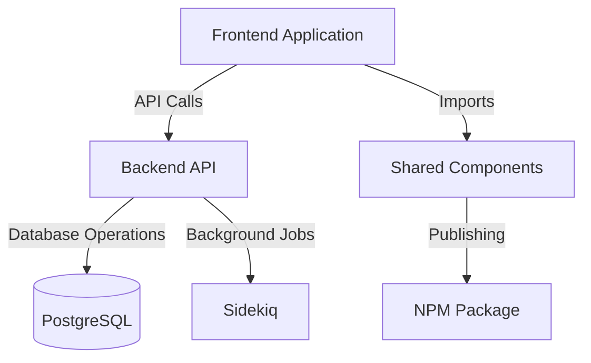

# Capa

- **Título do Projeto**: CowTech - Soluções Agropecuárias
- **Nome do Estudante**: Gustavo Henrique Dias
- **Curso**: Engenharia de Software.
- **Data de Entrega**: [Data].

# Resumo

O projeto CowTech é uma solução agropecuária que visa facilitar a gestão de fazendas e a produção de leite. O sistema oferece uma interface intuitiva para gerenciar animais, pastagens e produção de leite, além de fornecer insights para tomada de decisão. Uma das principais funcionalidades é a monitoração de vacas em lactação, permitindo acompanhar a produção de leite e identificar possíveis problemas, assim como manter seu histórico, como genitora, filho, etc.

## 3. Especificação Técnica

Descrição detalhada da proposta, incluindo requisitos de software, protocolos, algoritmos, procedimentos, formatos de dados, etc.

### 3.1. Requisitos de Software

- Apresentar os requisitos do tema proposto.
- **Lista de Requisitos:** Apresentar uma lista contendo os Requisitos Funcionais (RF) e Não-Funcionais (RNF).
- **Representação dos Requisitos:** Representar os RFs por meio de um Diagrama de Casos de Uso (UML).

### 3.2. Considerações de Design

- Discussão sobre as escolhas de design, incluindo alternativas consideradas e justificativas para as decisões tomadas.
- **Visão Inicial da Arquitetura**: Descrição dos componentes principais e suas interconexões.
- **Padrões de Arquitetura**: Indicação de padrões específicos utilizados (ex.: MVC, Microserviços).
- **Modelos C4**: Detalhamento da arquitetura em níveis: Contexto, Contêineres, Componentes, Código.

### 3.3. Stack Tecnológica

- **Linguagens de Programação**:
  - TypeScript
- **Frameworks e Bibliotecas**:
  - React
  - Node.js
  - Express
  - Sequelize
  - Styled Components
  - React Router
  - React Hook Form
  - React Query
  - React Toastify
  - React Icons
  - React Select
  - Yup
  - Jest
  - Cypress
  - Docker
  - PostgreSQL
  - Docker
  - Docker Compose
- **Ferramentas de Desenvolvimento e Gestão de Projeto**:
  - Git
  - GitHub
  - Github Actions
  - Github Projects
  - Github Wiki
  - Cursor
  - Docker
  - Docker Compose
  - MySQL

### 3.4. Considerações de Segurança

Análise de possíveis questões de segurança e como mitigá-las.

## 4. Próximos Passos

Descrição dos passos seguintes após a conclusão do documento, com uma visão geral do cronograma para Portfólio I e II.

## 5. Referências

Listagem de todas as fontes de pesquisa, frameworks, bibliotecas e ferramentas que serão utilizadas.

## 6. Apêndices (Opcionais)

Informações complementares, dados de suporte ou discussões detalhadas fora do corpo principal.

## Architecture Overview

## 7. Avaliações de Professores

Adicionar três páginas no final do RFC para que os Professores escolhidos possam fazer suas considerações e assinatura:

- Considerações Professor/a:
- Considerações Professor/a:
- Considerações Professor/a:
