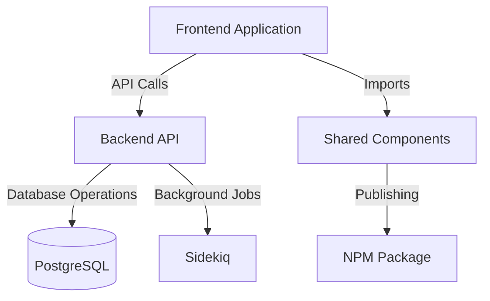

# Project Concepts

This documentation serves as the central hub for all repositories and components involved in the Project Concepts ecosystem. Here you'll find comprehensive information about each repository, their relationships, and how they work together.

## Repository Structure

### Frontend Application

- **Repository**: [project-concepts-frontend](https://github.com/organization/project-concepts-frontend)
- **Tech Stack**: React, TypeScript
- **Purpose**: Main user interface for the application
- **Key Features**:
  - Component library implementation
  - State management system
  - API integration layer
  - Unit and integration testing suite

### Backend API

- **Repository**: [project-concepts-api](https://github.com/organization/project-concepts-api)
- **Tech Stack**: Ruby on Rails, PostgreSQL
- **Purpose**: Core business logic and data management
- **Key Features**:
  - RESTful API endpoints
  - Authentication and authorization
  - Database management
  - Background job processing

### Shared Components Library

- **Repository**: [project-concepts-components](https://github.com/organization/project-concepts-components)
- **Tech Stack**: React, TypeScript, Storybook
- **Purpose**: Reusable UI components and design system
- **Key Features**:
  - Core UI components
  - Design tokens
  - Documentation
  - Visual regression testing

## Architecture Overview



## Development Setup

### Prerequisites

- Node.js 18+
- Ruby 3.2+
- PostgreSQL 14+
- Yarn or npm
- Redis (for background jobs)

### Local Development

1. **Clone all repositories**

```bash
git clone git@github.com:organization/project-concepts-frontend.git
git clone git@github.com:organization/project-concepts-api.git
git clone git@github.com:organization/project-concepts-components.git
```

2. **Set up environment variables**
   Copy the example environment files in each repository:

```bash
cp .env.example .env
```

3. **Install dependencies**

```bash
# Frontend
cd project-concepts-frontend
yarn install

# Backend
cd project-concepts-api
bundle install

# Components
cd project-concepts-components
yarn install
```

4. **Start the development servers**

```bash
# Frontend
yarn dev

# Backend
rails server

# Components
yarn storybook
```

## CI/CD Pipeline

Each repository has its own CI/CD pipeline implemented with GitHub Actions:

- **Frontend**: Build, test, and deploy to staging/production
- **Backend**: Test, security scan, and deploy to staging/production
- **Components**: Build, test, and publish to NPM

## Contributing

Please refer to the individual repository's CONTRIBUTING.md file for specific guidelines. General workflow:

1. Create a feature branch from `main`
2. Implement changes following our coding standards
3. Write/update tests
4. Submit a pull request
5. Code review process
6. Merge after approval

## Documentation

- [API Documentation](./api-docs/README.md)
- [Frontend Architecture](./frontend/ARCHITECTURE.md)
- [Component Library](./components/README.md)
- [Deployment Guide](./deployment/README.md)

## Contact

- **Tech Lead**: [tech-lead@organization.com](mailto:tech-lead@organization.com)
- **Project Manager**: [pm@organization.com](mailto:pm@organization.com)
- **Slack Channel**: #project-concepts

## License

All repositories are licensed under the MIT License. See the LICENSE file in each repository for details.
