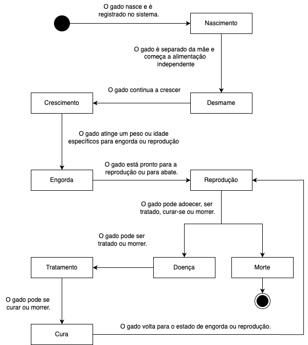
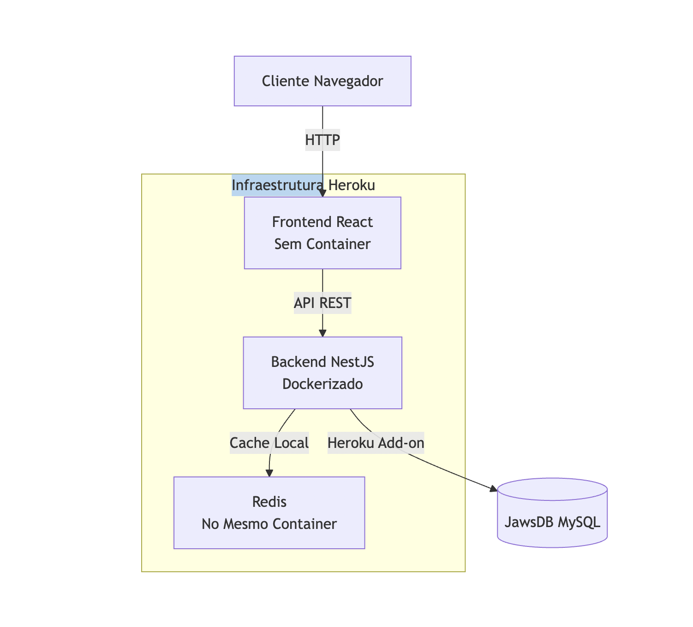

# FazendaPro - Soluções Agropecuárias

- **Título do Projeto**: [Título claro e conciso que reflete a essência do produto ou ferramenta].
- **Nome do Estudante**: Gustavo Henrique Dias.
- **Curso**: Engenharia de Software.
- **Data de Entrega**: [Data].

# Resumo

O projeto FazendaPro é uma solução agropecuária que visa facilitar a gestão de fazendas e a produção de leite. O sistema oferece uma interface intuitiva para gerenciar animais, pastagens e produção de leite, além de fornecer insights para tomada de decisão. Uma das principais funcionalidades é a monitoração de vacas em lactação, permitindo acompanhar a produção de leite e identificar possíveis problemas, assim como manter seu histórico, como genitora, filho, etc.

## 1. Introdução

- **Contexto**: o software se mostra útil no contexto pecuário, resolvendo problemas e facilitando o gerenciamento de animais.
- **Justificativa**: a ideia surgiu para resolver uma dor real de um fazendeiro do norte de Minas Gerais, que não tinha bons faturamentos na venda de seus animais, pois não tira o histórico de cada animal.
- **Objetivos**: o objetivo principal do projeto é criar um sistema que permita a gestão de fazendas e a produção de leite de forma eficiente e ágil, guardando histórico dos animais e calculando gastos e faturamento.

## 2. Descrição do Projeto

- **Tema do Projeto**: o tema do projeto é a gestão de fazendas, o histórico do gado e a produção de leite.
- **Problemas a Resolver**: o principal problema a ser resolvido é a garantia da valorização de um gado no mercado, por meio do seu histórico, desde o nascimento, genética, vacinas, alimentação entre outras informações. Além de oferecer um sistema baixo custo para produtores e fazendeiros que não tem acesso a tecnologias semelhantes por causa do altos preços do softwares existentes no mercado.
- **Limitações**: Delimitação dos problemas que o projeto não abordará.

## 3. Especificação Técnica

## Requisitos Funcionais (RF) - WIP

**1. RF01 - Acessar o Sistema**

- RF01.01 O sistema deve permitir que o usuário faça o login na plataforma com seus credenciais.
- RF01.02 O sistema deve validar as credenciais do usuário e conceder acesso apenas para os usuários que geraram o token.

**2. RF02 - Adicionar um Animal**

- RF02.01 sistema deve permitir que o usuário cadastre um novo animal no sistema.

- RF02.02 O sistema deve permitir incluir dados do animal como, no mínimo: identificação (nome e número do brinco), data de nascimento, genitora, filho (caso exista), raça, sexo e informações de saúde (vacinas).

**RF03 - Gerenciar o Animal**

- RF03.01 O sistema deve permitir que o usuário edite ou exclua as informações de um animal já cadastrado.
- RF03.02 O sistema deve oferecer a opção de exportar o histórico do animal em formato PDF.

**RF05 - Analisar Dashboards**

- RF05.01 O sistema deve fornecer dashboards com informações analíticas sobre os animais, como produção de leite, saúde geral, e tendências de desempenho.

**RF06 - Inserir Informações do Animal**

- RF06.01 O sistema deve permitir que o usuário insira informações adicionais sobre o animal, como registros de vacinas, alimentação, tratamentos ou eventos, como nascimento de filhotes.

**RF07 - Registrar Peso do Animal por Mês/Semana**

- RF07.01 O sistema deve permitir que o usuário registre o peso do animal em intervalos regulares (mensal ou semanal).
- RF07.02 O sistema deve armazenar esses registros para acompanhamento do desenvolvimento do animal.
- RF07.03 O sistema deve permitir a edição ou exclusão desses registros.

**RF08 - Mudar de Lote**

- RF08.01 O sistema deve mudar automaticamente o lote ao qual um animal pertence dependendo da sua produção de leite.

**RF09 - Definir Data de Prenhez**

- RF09.01 sistema deve permitir que o usuário registre a data de prenhez de uma vaca.
- RF09.02 sistema deve notificar o usuário (via WhatsApp) quando a data de prenhez estiver próxima do parto, 20 dias antes.

**RF10 - Vender o Animal**

- RF10.01 O sistema deve permitir que o usuário registre a venda de um animal.
- RF10.02 O sistema deve atualizar o status do animal para "vendido" e registrar a data da venda.
- RF10.03 O sistema deve oferecer a opção de exportar o histórico do animal em PDF no momento da venda.

## Requisitos Não Funcionais (RNF)

## Diagrama de Casos de uso


## Diagrama de Classes


## Diagram de Relacionamento


## Diagrama de Estados



### 3.2. Considerações de Design

**Visão Inicial da Arquitetura**: Foi decidido usar a arquitetura modular para o projeto. A arquitetura modular oferece um equilíbrio entre a simplicidade de um monolito e a flexibilidade dos microserviços. O NestJS facilita essa abordagem através de seus módulos bem definidos, permitindo escalabilidade sem a complexidade inicial dos microserviços. Esta escolha permite que o sistema cresça naturalmente, com a possibilidade de extrair módulos para microserviços no futuro (como é o caso das notificações no futuro).

**Padrões de Arquitetura**: A ideia seria usar uma arquitetura limpa como o DDD (Domain-Driven Design) com arquitetura hexagonal.

```bash
src/
├── core/                 # Núcleo da aplicação (domínio)
│   ├── domain/           # Entidades e regras de negócio
│   │   ├── entities/     # Entidades de domínio puras
│   │   ├── value-objects/# Objetos de valor
│   │   ├── events/       # Eventos de domínio
│   │   └── services/     # Serviços de domínio
│   ├── application/      # Casos de uso da aplicação
│   │   ├── commands/     # Comandos para alterar estado
│   │   ├── queries/      # Consultas para buscar dados
│   │   ├── dtos/         # Objetos de transferência de dados
│   │   └── interfaces/   # Interfaces para as portas
│   └── ports/            # Portas para interagir com o mundo externo
│       ├── input/        # Portas de entrada (API, CLI)
│       └── output/       # Portas de saída (Repos, Serviços externos)
├── infrastructure/       # Implementações técnicas
│   ├── database/         # Configuração e implementações de BD
│   │   ├── repositories/ # Implementações dos repositórios
│   │   ├── models/       # Modelos ORM
│   │   └── migrations/   # Migrações de BD
│   ├── http/             # Adaptadores HTTP
│   │   ├── controllers/  # Controladores NestJS
│   │   ├── middlewares/  # Middlewares
│   │   └── dtos/         # DTOs específicos da API
│   ├── auth/             # Implementação de autenticação
│   └── external-services/# Serviços externos
├── modules/              # Módulos de domínio específicos
│   └── user-management/  # Módulo de gestão de usuários
└── shared/               # Utilidades compartilhadas
    ├── utils/            # Funções utilitárias
    ├── decorators/       # Decoradores personalizados
    ├── interceptors/     # Interceptadores NestJS
    ├── filters/          # Filtros de exceção
    └── constants/        # Constantes da aplicação
```

### Modelos C4:



**Aplicação Web:** React.

**Api Server:** servidor NestJS em container no Heroku, funcionando como núcleo do sistema.

Inclui: Redis rodando no mesmo container para caching em memória.

**Armazenamento persistente de dados (MySql)**

**Interações:**
A Aplicação Web faz requisições HTTP (REST) ao API Server.
O API Server usa Redis internamente para caching e consulta o JawsDB MySQL via conexão SQL.

### 3.3. Stack Tecnológica

- **Linguagens de Programação**: Justificativa para a escolha de linguagens específicas.
- **Frameworks e Bibliotecas**:
  - React
  - Nest.js
  - TypeORM
  - JWT
  - Bcrypt
  - Express
  - Styled Components (em poucos casos)
  - React Router
  - React Hook Form
  - React Query
  - React Toastify
  - React Icons
  - Yup
  - Jest
  - Cypress
  - Docker
  - MySql
  - Docker
  - Docker Compose
- **Ferramentas de Desenvolvimento e Gestão de Projeto**: Para a gestão do projeto foi utilizado o Github Projects para criar as atividades. Algumas atividades já foram criadas e podem ser vistas neste [link](https://github.com/orgs/fazendapro/projects/1).

### 3.4. Considerações de Segurança

#### Autenticação e Autorização (as rotas serão protegidas)

- Credenciais expostas (senhas fracas ou vazamento de tokens).
  - Vai ser utilizado hash para senhas com bcrypt
- Falta de proteção contra ataques de força bruta.
  - Será usado limite de tentativas de login (rate limiting) com @nestjs/throttler

#### Exposição de Dados Sensíveis

- Vazamento de informações em respostas da API
  - Será usado DTO para retornar apenas o necessário pela API.
- Configurações inadequadas de CORS permitindo acesso não autorizado.
- Logs com informações sensíveis
  - O Heroku usa automaticamente o HTTPS para criptografar a comunicação.

#### Injeção de Código (SQL Injection, XSS, etc.)

- Consultas SQL no backend
  - será usado o TypeORM e não queries brutas
- Scripts maliciosos injetados no frontend React via entradas de usuário
  - será implementado Content Security Policy (CSP) no frontend para limitar fontes de scripts.

## 4. Próximos Passos

Descrição dos passos seguintes após a conclusão do documento, com uma visão geral do cronograma para Portfólio I e II.

## 5. Referências

Listagem de todas as fontes de pesquisa, frameworks, bibliotecas e ferramentas que serão utilizadas.

## 6. Apêndices (Opcionais)

Informações complementares, dados de suporte ou discussões detalhadas fora do corpo principal.

## 7. Avaliações de Professores

Adicionar três páginas no final do RFC para que os Professores escolhidos possam fazer suas considerações e assinatura:

- Considerações Professor/a:
- Considerações Professor/a:
- Considerações Professor/a:

escrever sobre:

- new relic
- redis para cache
- sentry
- integração ci/cd com Heroku
