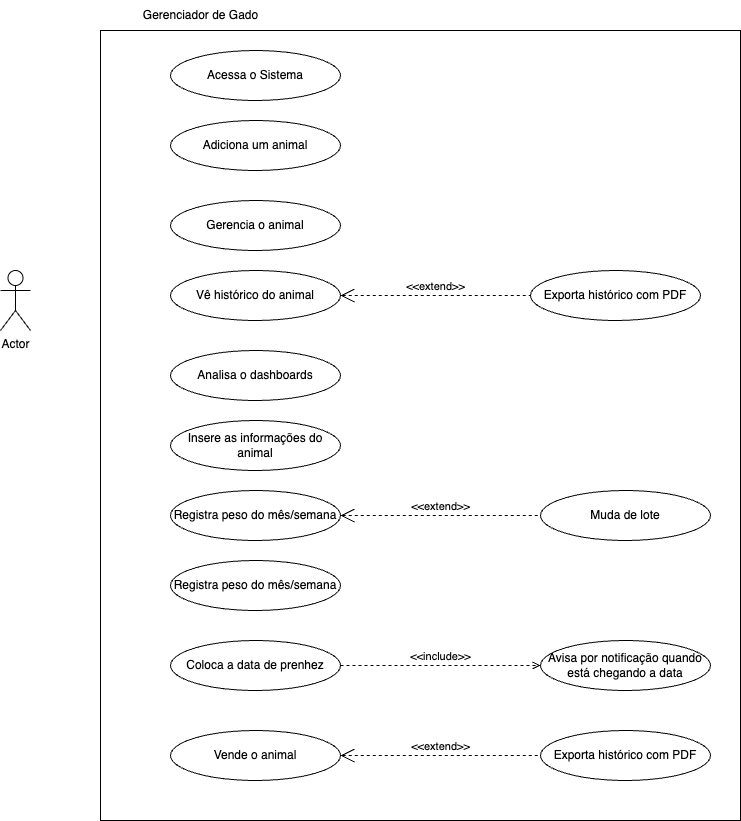

# FazendaPro - Soluções Agropecuárias

- **Título do Projeto**: [Título claro e conciso que reflete a essência do produto ou ferramenta].
- **Nome do Estudante**: Gustavo Henrique Dias.
- **Curso**: Engenharia de Software.
- **Data de Entrega**: [Data].

# Resumo

O projeto FazendaPro é uma solução agropecuária que visa facilitar a gestão de fazendas e a produção de leite. O sistema oferece uma interface intuitiva para gerenciar animais, pastagens e produção de leite, além de fornecer insights para tomada de decisão. Uma das principais funcionalidades é a monitoração de vacas em lactação, permitindo acompanhar a produção de leite e identificar possíveis problemas, assim como manter seu histórico, como genitora, filho, etc.

## 1. Introdução

- **Contexto**: o software se mostra útil no contexto pecuário, resolvendo problemas e facilitando o gerenciamento de animais.
- **Justificativa**: a ideia surgiu para resolver uma dor real de um fazendeiro do norte de Minas Gerais, que não tinha bons faturamentos na venda de seus animais, pois não tira o histórico de cada animal.
- **Objetivos**: o objetivo principal do projeto é criar um sistema que permita a gestão de fazendas e a produção de leite de forma eficiente e ágil, guardando histórico dos animais e calculando gastos e faturamento.

## 2. Descrição do Projeto

- **Tema do Projeto**: o tema do projeto é a gestão de fazendas, o histórico do gado e a produção de leite.
- **Problemas a Resolver**: o principal problema a ser resolvido é a garantia da valorização de um gado no mercado, por meio do seu histórico, desde o nascimento, genética, vacinas, alimentação entre outras informações. Além de oferecer um sistema baixo custo para produtores e fazendeiros que não tem acesso a tecnologias semelhantes por causa do altos preços do softwares existentes no mercado.
- **Limitações**: Delimitação dos problemas que o projeto não abordará.

## 3. Especificação Técnica

## Requisitos Funcionais (RF) - WIP

**1. RF01 - Acessar o Sistema**

- O sistema deve permitir que o usuário faça o login na plataforma com seus credenciais.
- O sistema deve validar as credenciais do usuário e conceder acesso apenas para os usuários que geraram o token.

**2. RF02 - Adicionar um Animal**

- O sistema deve permitir que o usuário cadastre um novo animal no sistema.

  - O sistema deve permitir incluir dados do animal como, no mínimo: identificação (nome e número do brinco), data de nascimento, genitora, filho (caso exista), raça, sexo e informações de saúde (vacinas).

**RF03 - Gerenciar o Animal**

- O sistema deve permitir que o usuário edite ou exclua as informações de um animal já cadastrado.
- O sistema deve oferecer a opção de exportar o histórico do animal em formato PDF.

**RF05 - Analisar Dashboards**

- O sistema deve fornecer dashboards com informações analíticas sobre os animais, como produção de leite, saúde geral, e tendências de desempenho.

**RF06 - Inserir Informações do Animal**

- O sistema deve permitir que o usuário insira informações adicionais sobre o animal, como registros de vacinas, alimentação, tratamentos ou eventos, como nascimento de filhotes.

**RF07 - Registrar Peso do Animal por Mês/Semana**

- O sistema deve permitir que o usuário registre o peso do animal em intervalos regulares (mensal ou semanal).
- O sistema deve armazenar esses registros para acompanhamento do desenvolvimento do animal.
- O sistema deve permitir a edição ou exclusão desses registros.

**RF08 - Mudar de Lote**

- O sistema deve mudar automaticamente o lote ao qual um animal pertence dependendo da sua produção de leite.

**RF09 - Colocar Data de Prenhez**

- O sistema deve permitir que o usuário registre a data de prenhez de uma vaca.
- O sistema deve notificar o usuário (via WhatsApp) quando a data de prenhez estiver próxima do parto, 20 dias antes.

**RF10 - Vender o Animal**

- O sistema deve permitir que o usuário registre a venda de um animal.
- O sistema deve atualizar o status do animal para "vendido" e registrar a data da venda.
- O sistema deve oferecer a opção de exportar o histórico do animal em PDF no momento da venda.

- **Representação dos Requisitos:**
  

### 3.2. Considerações de Design

- Discussão sobre as escolhas de design, incluindo alternativas consideradas e justificativas para as decisões tomadas.
- **Visão Inicial da Arquitetura**: Descrição dos componentes principais e suas interconexões.
- **Padrões de Arquitetura**: A ideia principal seria usar uma arquitetura MVC para o backend do projeto e usar um microsserviço de notificação para enviar um chat no Whatsapp quando for concluído.
- **Modelos C4**: Detalhamento da arquitetura em níveis: Contexto, Contêineres, Componentes, Código.

### 3.3. Stack Tecnológica

- **Linguagens de Programação**: Justificativa para a escolha de linguagens específicas.
- **Frameworks e Bibliotecas**:
  - React
  - Nest.js
  - TypeORM
  - JWT
  - Bcrypt
  - Express
  - Styled Components (em poucos casos)
  - React Router
  - React Hook Form
  - React Query
  - React Toastify
  - React Icons
  - Yup
  - Jest
  - Cypress
  - Docker
  - MySql
  - Docker
  - Docker Compose
- **Ferramentas de Desenvolvimento e Gestão de Projeto**: Para a gestão do projeto foi utilizado o Github Projects para criar as atividades. Algumas atividades já foram criadas e podem ser vistas neste [link](https://github.com/orgs/fazendapro/projects/1).

### 3.4. Considerações de Segurança

1. Autenticação e Autorização (as rotas serão protegidas)

- Credenciais expostas (senhas fracas ou vazamento de tokens).
  - Vai ser utilizado hash para senhas com bcrypt
- Falta de proteção contra ataques de força bruta.
- Será usado limite de tentativas de login (rate limiting) com @nestjs/throttler

2. Exposição de Dados Sensíveis

- Vazamento de informações em respostas da API
- Será usado DTO para retornar apenas o necessário pela API.
- Configurações inadequadas de CORS permitindo acesso não autorizado.
- Logs com informações sensíveis
- O Heroku usa automaticamente o HTTPS para criptografar a comunicação.

3. Injeção de Código (SQL Injection, XSS, etc.)

- Consultas SQL no backend
- será usado o TypeORM e não queries brutas
- Scripts maliciosos injetados no frontend React via entradas de usuário
- será implementado Content Security Policy (CSP) no frontend para limitar fontes de scripts.

## 4. Próximos Passos

Descrição dos passos seguintes após a conclusão do documento, com uma visão geral do cronograma para Portfólio I e II.

## 5. Referências

Listagem de todas as fontes de pesquisa, frameworks, bibliotecas e ferramentas que serão utilizadas.

## 6. Apêndices (Opcionais)

Informações complementares, dados de suporte ou discussões detalhadas fora do corpo principal.

## 7. Avaliações de Professores

Adicionar três páginas no final do RFC para que os Professores escolhidos possam fazer suas considerações e assinatura:

- Considerações Professor/a:
- Considerações Professor/a:
- Considerações Professor/a:
