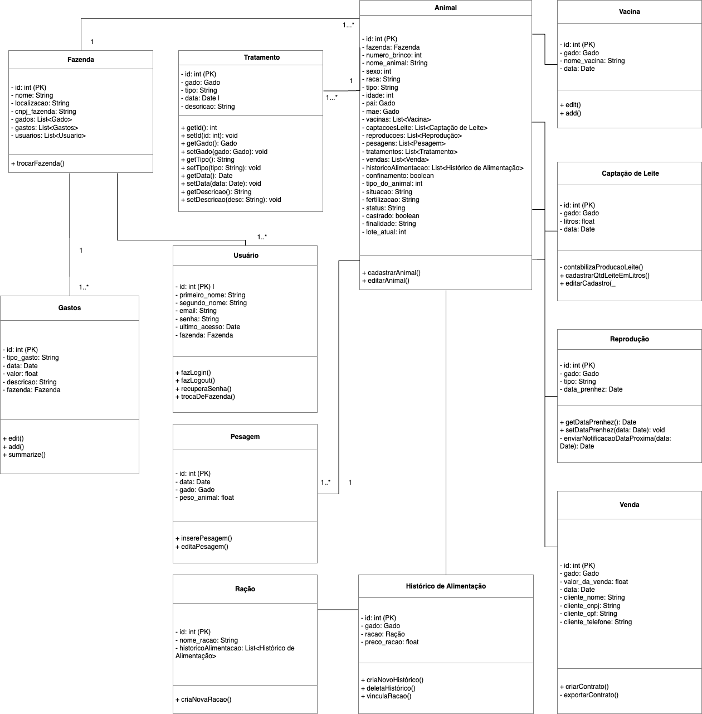
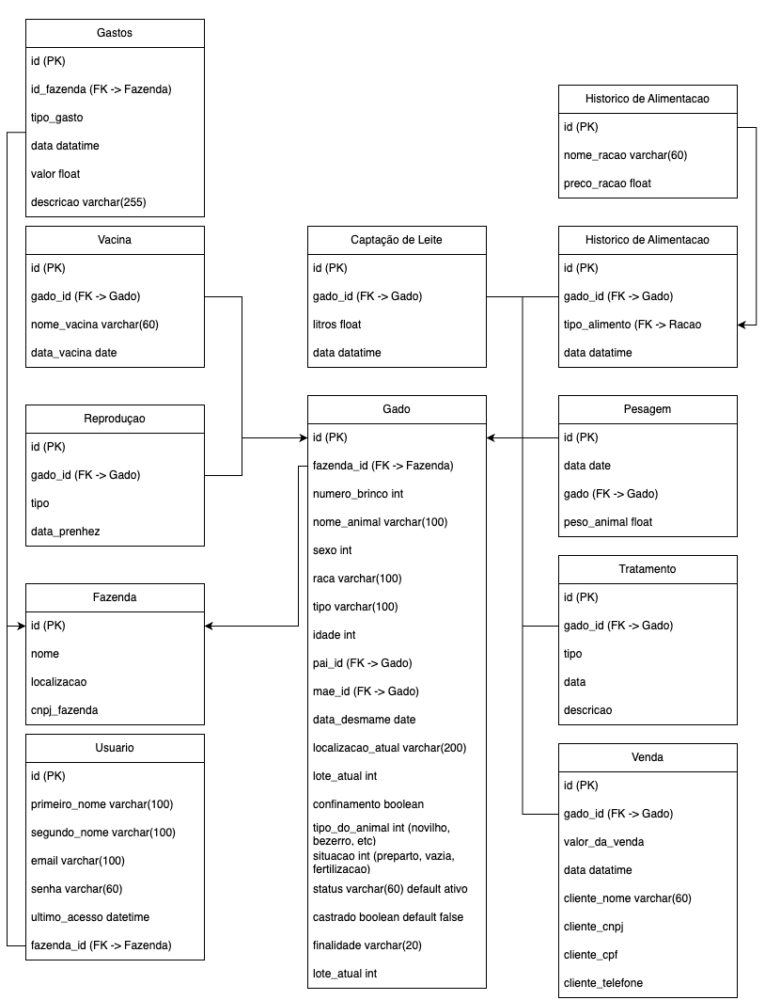
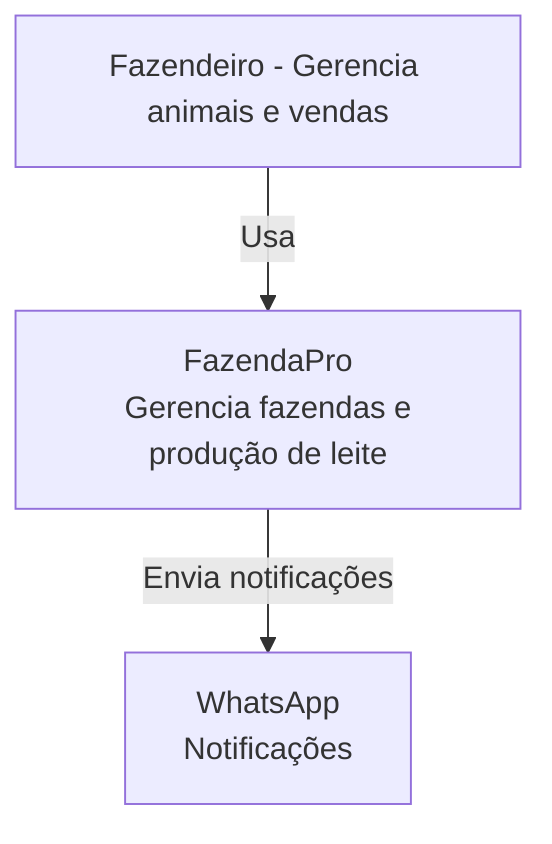
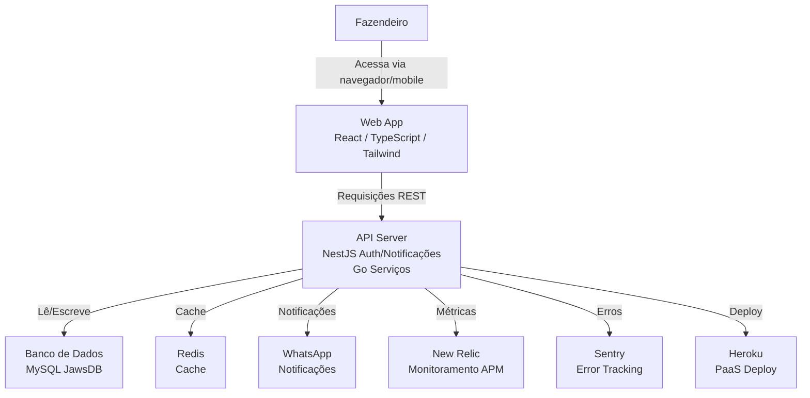
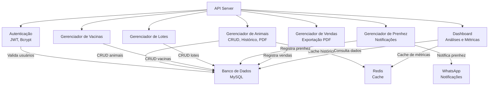
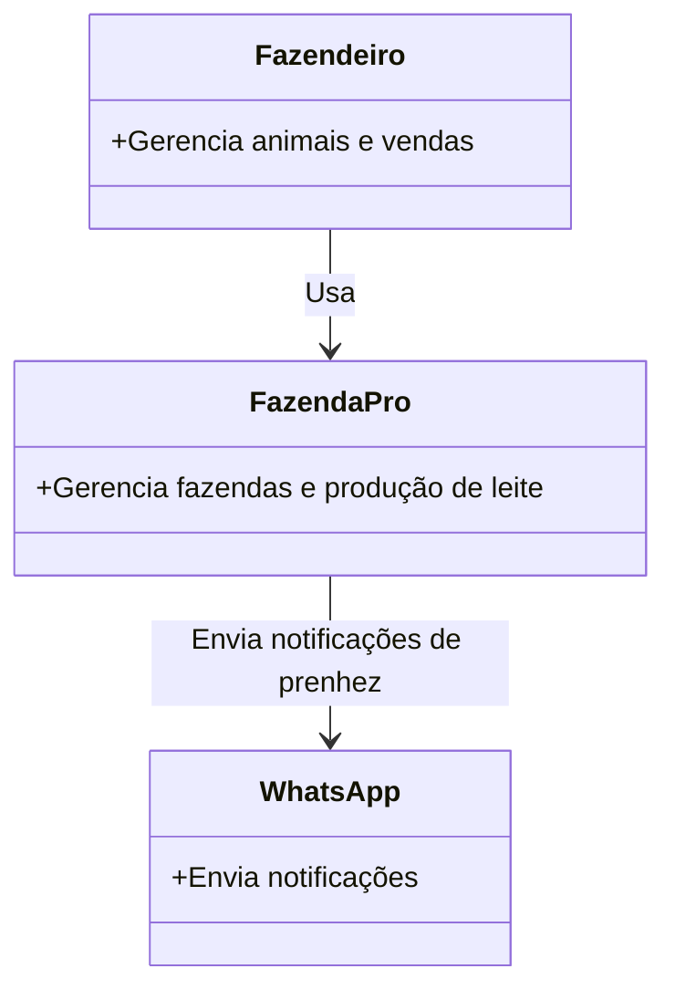
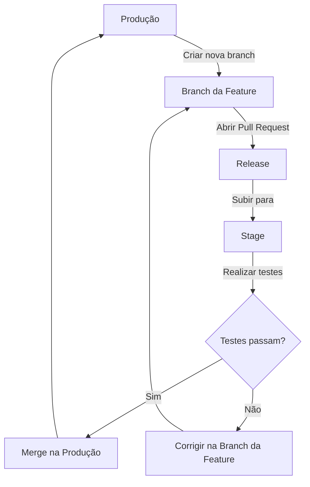

# FazendaPro - Soluções Agropecuárias

- **Título do Projeto**: [Título claro e conciso que reflete a essência do produto ou ferramenta].
- **Nome do Estudante**: Gustavo Henrique Dias.
- **Curso**: Engenharia de Software.
- **Data de Entrega**: [Data].

# Resumo

O projeto FazendaPro é uma solução agropecuária que visa facilitar a gestão de fazendas e a produção de leite. O sistema oferece uma interface intuitiva para gerenciar animais, pastagens e produção de leite, além de fornecer insights para tomada de decisão. Uma das principais funcionalidades é a monitoração de vacas em lactação, permitindo acompanhar a produção de leite e identificar possíveis problemas, assim como manter seu histórico, como genitora, filho, etc.

## 1. Introdução

- **Contexto**: O projeto FazendaPro insere-se no contexto da pecuária leiteira brasileira, um setor essencial para a economia, mas que enfrenta desafios significativos, especialmente entre pequenos e médios produtores rurais. No Brasil, a pecuária leiteira é marcada por práticas tradicionais de gestão, com muitos fazendeiros utilizando métodos manuais ou planilhas para controlar animais, pastagens e produção de leite. Esse cenário resulta em ineficiências, como a falta de rastreamento do histórico genético e de saúde dos animais, dificuldades na previsão de faturamento e altos custos operacionais. O problema reside, principalmente, na ausência de ferramentas acessíveis que integrem dados de forma prática e ofereçam insights para otimizar a produção. No norte de Minas Gerais, por exemplo, produtores relatam dificuldades em valorizar seus animais no mercado devido à falta de documentação detalhada sobre sua procedência e desempenho. O FazendaPro busca resolver essas dores, proporcionando uma solução tecnológica de baixo custo, adaptada às necessidades dos produtores rurais.

- **Justificativa**: A criação do FazendaPro é justificada pela necessidade de modernizar a gestão pecuária, especialmente para pequenos e médios produtores que enfrentam barreiras no acesso a tecnologias avançadas. No Brasil, a pecuária leiteira representa uma fonte de renda para milhares de famílias, mas a falta de ferramentas acessíveis limita a competitividade e a lucratividade. Um fazendeiro do norte de Minas Gerais, por exemplo, relatou perdas significativas na venda de animais devido à ausência de um histórico detalhado que comprove sua qualidade genética e sanitária. Além disso, sistemas existentes no mercado muitas vezes possuem custos elevados, interfaces complexas e não atendem às necessidades específicas de produtores rurais. O FazendaPro é importante porque oferece uma solução de baixo custo, intuitiva e escalável, que permite o acompanhamento detalhado de cada animal, aumenta a valorização do gado no mercado e promove a tomada de decisões baseadas em dados. Ao democratizar o acesso à tecnologia, o projeto contribui para a sustentabilidade econômica e social do setor agropecuário, reduzindo custos operacionais, aumentando a eficiência e fortalecendo a rastreabilidade.
- **Objetivos**:
- Objetivo Principal:
  - Desenvolver uma plataforma digital que permita a gestão eficiente de fazendas leiteiras, garantindo a valorização do gado no mercado por meio do registro detalhado de seu histórico genético, sanitário e produtivo.
- Objetivos Secundários:
  - Criar um sistema de baixo custo que seja acessível a pequenos e médios produtores rurais.
  - Implementar funcionalidades para monitoramento em tempo real da produção de leite e da saúde animal.
  - Automatizar processos como notificações de prenhez e mudança de lotes, reduzindo o trabalho manual.
  - Fornecer dashboards analíticos que auxiliem na tomada de decisão com base em dados de desempenho.
  - Garantir a exportação de históricos em PDF para facilitar negociações e vendas de animais.
  - Desenvolver uma interface responsiva e intuitiva, adaptada para uso em dispositivos móveis.

## 2. Descrição do Projeto

- **Tema do Projeto**: o tema do projeto é o desenvolvimento de uma aplicação web focada na gestão de fazendas de gado leiteiro, com ênfase no registro histórico dos animais e na otimização da produção de leite. A FazendaPro combina tecnologia de ponta, como interfaces modernas e análises de dados, com uma abordagem acessível para atender às demandas de produtores rurais que enfrentam dificuldades na gestão manual ou com ferramentas de alto custo. O projeto abrange o controle de informações sobre o gado (genética, vacinas, alimentação, reprodução), a automação de processos operacionais e a geração de relatórios que aumentam a competitividade no mercado. Esse tema é relevante no contexto da transformação digital do agronegócio, promovendo eficiência, rastreabilidade e sustentabilidade.
- **Problemas a Resolver**: o principal problema a ser resolvido é a garantia da valorização de um gado no mercado, por meio do seu histórico, desde o nascimento, genética, vacinas, alimentação entre outras informações. Além de oferecer um sistema baixo custo para produtores e fazendeiros que não tem acesso a tecnologias semelhantes por causa do altos preços do softwares existentes no mercado.
- **Limitações**: Delimitação dos problemas que o projeto não abordará.

## 3. Especificação Técnica

## Requisitos Funcionais (RF)

**1. RF01 - Acessar o Sistema**

- RF01.01 O sistema deve permitir que o usuário faça o login na plataforma com seus credenciais.
- RF01.02 O sistema deve validar as credenciais do usuário e conceder acesso apenas para os usuários que geraram o token.

**2. RF02 - Adicionar um Animal**

- RF02.01 sistema deve permitir que o usuário cadastre um novo animal no sistema.
- RF02.02 O sistema deve permitir incluir dados do animal como, no mínimo: identificação (nome e número do brinco), data de nascimento, genitora, filho (caso exista), raça, sexo e informações de saúde (vacinas).

**RF03 - Gerenciar o Animal**

- RF03.01 O sistema deve permitir que o usuário edite ou exclua as informações de um animal já cadastrado.
- RF03.02 O sistema deve oferecer a opção de exportar o histórico do animal em formato PDF.

**RF05 - Analisar Dashboards**

- RF05.01 O sistema deve fornecer dashboards com informações analíticas sobre os animais, como produção de leite, saúde geral, e tendências de desempenho.

**RF06 - Inserir Informações do Animal**

- RF06.01 O sistema deve permitir que o usuário insira informações adicionais sobre o animal, como registros de vacinas, alimentação, tratamentos ou eventos, como nascimento de filhotes.

**RF07 - Registrar Peso do Animal por Mês/Semana**

- RF07.01 O sistema deve permitir que o usuário registre o peso do animal em intervalos regulares (mensal ou semanal).
- RF07.02 O sistema deve armazenar esses registros para acompanhamento do desenvolvimento do animal.
- RF07.03 O sistema deve permitir a edição ou exclusão desses registros.

**RF08 - Mudar de Lote**

- RF08.01 O sistema deve mudar automaticamente o lote ao qual um animal pertence dependendo da sua produção de leite.

**RF09 - Definir Data de Prenhez**

- RF09.01 sistema deve permitir que o usuário registre a data de prenhez de uma vaca.
- RF09.02 sistema deve notificar o usuário (via WhatsApp) quando a data de prenhez estiver próxima do parto, 20 dias antes.

**RF10 - Vender o Animal**

- RF10.01 O sistema deve permitir que o usuário registre a venda de um animal.
- RF10.02 O sistema deve atualizar o status do animal para "vendido" e registrar a data da venda.
- RF10.03 O sistema deve oferecer a opção de exportar o histórico do animal em PDF no momento da venda.
- RF10.04 O sistema deve permitir verificar o histórico de todas as vendas dentro do módulo de vendas

**RF11 - Cadastrar Vacinas**

- RF11.01 O sistema deve permitir que o usuário cadastre a vacina para que depois ela seja vinculada ao animal
- RF11.02 O sistema deve permitir a pesquisa de vacinas por datas

**RF12 - Separar Módulo**

- RF12.01 O sistema deve organizar as informações através de módulos dentro de um menu lateral (Dashboard, Vacas, Fornecedores, Vendas, Estoque)

**RF13 - Sair da Plataforma**

- RF13.01 O sistema deve permitir que o usuário faça o logout da plataforma

## Requisitos Não Funcionais (RNF)

**1. RNF01 - Estilização**

- RNF01.01 A estilização da aplicação deve seguir os padrões de estilo do Figma
- RNF01.02 Para facilitar a estilização deve ser usado Tailwind ou outra biblioteca de CSS
- RNF01.03 Componentes padrões devem ser criados para seguir um padrão geral
- RNF01.04 As cores da aplicação devem apresentar-se de forma agradável

**2. RNF02 - Ferramentas**

- RNF02.01 Para o Frontend deve-se utilizar React com bibliotecas para facilitar o fetch das informações
- RNF02.02 Para o Backend será usado NestJS para serviços de autenticação e notificações, contudo para todo os resto será usado Go

**3. RNF03 - Idiomas**

- RNF03.01 Todo o desenvolvimento deve ser feito respeitando variáveis de idioma
- RNF02.02 O idioma principal será PT-BR, posteriormente pode ser implementado EN-US e ES-ES

**4. RNF04 - Mobile**

- RNF04.01 - O desenvolvimento deve respeitar os casos de mobile, respeitando um design responsivo e agradável

## Diagrama de Casos de uso


## Diagrama de Classes



## Diagram de Relacionamento



### 3.2. Considerações de Design

**Visão Inicial da Arquitetura**: Foi decidido usar a arquitetura modular para o projeto. A arquitetura modular oferece um equilíbrio entre a simplicidade de um monolito e a flexibilidade dos microserviços. O NestJS facilita essa abordagem através de seus módulos bem definidos, permitindo escalabilidade sem a complexidade inicial dos microserviços. Esta escolha permite que o sistema cresça naturalmente, com a possibilidade de extrair módulos para microserviços no futuro (como é o caso das notificações no futuro).

**Padrões de Arquitetura**: A ideia seria usar uma arquitetura limpa como o DDD (Domain-Driven Design) com arquitetura hexagonal.

```bash
fazendapro-api/
├── api/                    # Definições de handlers e endpoints HTTP
│   ├── handlers/           # Funções que lidam com requisições HTTP
│   │   ├── user.go         # Ex.: handler para rotas de usuário
│   │   └── product.go      # Ex.: handler para rotas de produtos
│   └── middleware/         # Middlewares (ex.: autenticação JWT)
│       └── auth.go         # Middleware de validação de token
├── cmd/                    # Ponto de entrada do projeto
│   └── app/                # Aplicação principal
│       └── main.go         # Arquivo principal que inicializa o servidor
├── config/                 # Configurações (ex.: variáveis de ambiente)
│   └── config.go           # Carrega .env ou outras configs
├── internal/               # Código interno (não exposto para outros pacotes)
│   ├── models/             # Estruturas de dados (ex.: User, Product)
│   │   ├── user.go
│   │   └── product.go
│   ├── repository/         # Acesso a dados (ex.: banco de dados)
│   │   ├── user_repository.go
│   │   └── product_repository.go
│   └── service/            # Lógica de negócio
│       ├── user_service.go
│       └── product_service.go
├── pkg/                    # Código reutilizável (se necessário)
│   └── jwt/                # Funções utilitárias para JWT
│       └── jwt.go
├── scripts/                # Scripts úteis (ex.: para build ou deploy)
├── tests/                  # Testes unitários e de integração
│   ├── handlers/
│   ├── repository/
│   └── service/
├── .env                    # Variáveis de ambiente (ex.: JWT_SECRET)
├── go.mod                  # Definição do módulo Go
├── go.sum                  # Dependências
└── README.md               # Documentação do projeto
```

### Modelos C4:







**Aplicação Web:** React.

**Api Server:** servidor NestJS em container no Heroku, funcionando como núcleo do sistema.

Inclui: Redis rodando no mesmo container para caching em memória.

## Modelo C4 - Contexto



#### Armazenamento persistente de dados (MySql)

**Interações:**
A Aplicação Web faz requisições HTTP (REST) ao API Server.
O API Server usa Redis internamente para caching e consulta o JawsDB MySQL via conexão SQL.

### 3.3. Stack Tecnológica

- **Linguagens de Programação**: Justificativa para a escolha de linguagens específicas.
- **Frameworks e Bibliotecas**:
  Aqui está a lista formatada no mesmo estilo Markdown que você forneceu, com os links para os sites oficiais ou páginas de documentação de cada ferramenta: - [React](https://react.dev) - [Nest.js](https://nestjs.com) - [TypeORM](https://typeorm.io) - [Go](https://go.dev) - [JWT](https://jwt.io) - [Bcrypt](https://www.npmjs.com/package/bcrypt) - [Express](https://expressjs.com) - [Styled Components (em poucos casos)](https://styled-components.com) - [React Router](https://reactrouter.com) - [React Hook Form](https://react-hook-form.com) - [React Query](https://tanstack.com/query) - [React Toastify](https://fkhadra.github.io/react-toastify/) - [React Icons](https://react-icons.github.io/react-icons/) - [Yup](https://github.com/jquense/yup) - [Jest](https://jestjs.io) - [Cypress](https://www.cypress.io) - [Docker](https://www.docker.com) - [MySql](https://www.mysql.com) - [Docker Compose](https://docs.docker.com/compose/)
- **Ferramentas de Desenvolvimento e Gestão de Projeto**: Para a gestão do projeto foi utilizado o Github Projects para criar as atividades. Algumas atividades já foram criadas e podem ser vistas neste [link](https://github.com/orgs/fazendapro/projects/1).

### 3.4. Considerações de Segurança

#### Autenticação e Autorização (as rotas serão protegidas)

- Credenciais expostas (senhas fracas ou vazamento de tokens).
  - Vai ser utilizado hash para senhas com bcrypt
- Falta de proteção contra ataques de força bruta.
  - Será usado limite de tentativas de login (rate limiting) com @nestjs/throttler

#### Exposição de Dados Sensíveis

- Vazamento de informações em respostas da API
  - Será usado DTO para retornar apenas o necessário pela API.
- Configurações inadequadas de CORS permitindo acesso não autorizado.
- Logs com informações sensíveis
  - O Heroku usa automaticamente o HTTPS para criptografar a comunicação.

#### Injeção de Código (SQL Injection, XSS, etc.)

- Consultas SQL no backend
  - será usado o TypeORM e não queries brutas
- Scripts maliciosos injetados no frontend React via entradas de usuário
  - será implementado Content Security Policy (CSP) no frontend para limitar fontes de scripts.

### 3.5 Branches e pipeline

Atualmente temos 6 branches principais que se relacionam aos ambientes de stage e produção e que são responsáveis por todos os componentes da aplicação: Serviços, Backend e Frontend.

**Stage:**

- back/develop - para o backend
- front/develop - para o frontend
- service/release - para os microsserviços

**Produção:**

- back/release - para o backend
- front/release - para o frontend
- service/release - para os microsserviços

Toda vez que eu for começar um feature nova eu crio uma branch a partir de produção. Para testes, eu abro a Pull Request apontando para a release, eu subo ela em stage e faço os testes necessários. Caso eles passem, eu faço o merge dessa branch em produção.



## 4. Próximos Passos

Descrição dos passos seguintes após a conclusão do documento, com uma visão geral do cronograma para Portfólio I e II.

Com certeza! Farei as adaptações necessárias para tornar a seção 5 mais formal e alinhada ao estilo acadêmico.

---

## 5. Referências

Esta seção compila as **fontes de pesquisa**, **frameworks**, **bibliotecas** e **ferramentas** que fundamentam o desenvolvimento do projeto FazendaPro. A inclusão destas referências visa proporcionar transparência quanto às tecnologias e conhecimentos empregados, além de possibilitar a consulta e verificação por parte dos interessados.

### 5.1. Linguagens de Programação

- **Go**: Adotada para a implementação dos microsserviços de _backend_, devido à sua eficiência, concorrência nativa e performance em ambientes de alta demanda. [Disponível em: [https://go.dev](https://go.dev)].
- **TypeScript**: Selecionada para o desenvolvimento do _frontend_, oferecendo uma camada de tipagem estática ao JavaScript, o que contribui para a robustez e manutenibilidade do código. [Disponível em: [https://www.typescriptlang.org/](https://www.typescriptlang.org/)].
- **JavaScript**: Linguagem fundamental para o desenvolvimento web, empregada tanto no _frontend_ (em conjunto com React e TypeScript) quanto no _backend_ (por meio do ambiente Node.js para o Nest.js). [Disponível em: [https://developer.mozilla.org/pt-BR/docs/Web/JavaScript](https://developer.mozilla.org/pt-BR/docs/Web/JavaScript)].

### 5.2. Frameworks e Bibliotecas

- **React**: Biblioteca JavaScript para a construção de interfaces de usuário reativas e componentizadas. [Disponível em: [https://react.dev](https://react.dev)].
- **Nest.js**: Framework Node.js progressivo para a construção de aplicações _backend_ eficientes, escaláveis e com arquitetura modular. [Disponível em: [https://nestjs.com](https://nestjs.com)].
- **TypeORM**: Mapeador Objeto-Relacional (ORM) para TypeScript e JavaScript, que facilita a interação com bancos de dados relacionais. [Disponível em: [https://typeorm.io](https://typeorm.io)].
- **JWT (JSON Web Tokens)**: Padrão aberto utilizado para a criação de tokens de acesso, empregado na implementação de mecanismos de autenticação e autorização. [Disponível em: [https://jwt.io](https://jwt.io)].
- **Bcrypt**: Biblioteca criptográfica para a função de _hash_ de senhas, essencial para garantir a segurança das credenciais dos usuários. [Disponível em: [https://www.npmjs.com/package/bcrypt](https://www.npmjs.com/package/bcrypt)].
- **Express**: Framework web para Node.js, serve como base para a construção de APIs e rotas, sendo um componente subjacente em algumas implementações do Nest.js. [Disponível em: [https://expressjs.com](https://expressjs.com)].
- **Styled Components**: Biblioteca que permite a estilização de componentes React utilizando a abordagem CSS-in-JS. [Disponível em: [https://styled-components.com](https://styled-components.com)].
- **React Router**: Biblioteca para gerenciamento de roteamento declarativo em aplicações React de página única (SPA). [Disponível em: [https://reactrouter.com](https://reactrouter.com)].
- **React Hook Form**: Biblioteca para gerenciamento e validação de formulários em aplicações React, com foco em performance e simplicidade. [Disponível em: [https://react-hook-form.com](https://react-hook-form.com)].
- **React Query**: Biblioteca para gerenciamento de estado do servidor, otimizando a obtenção, armazenamento em cache e sincronização de dados. [Disponível em: [https://tanstack.com/query](https://tanstack.com/query)].
- **React Toastify**: Biblioteca para exibição de notificações não obstrutivas (_toast notifications_) na interface do usuário. [Disponível em: [https://fkhadra.github.io/react-toastify/](https://fkhadra.github.io/react-toastify/)].
- **React Icons**: Conjunto de bibliotecas de ícones populares, facilitando a inclusão de elementos visuais na interface. [Disponível em: [https://react-icons.github.io/react-icons/](https://react-icons.github.io/react-icons/)].
- **Yup**: Construtor de esquemas JavaScript para validação de dados, utilizado para garantir a integridade das informações inseridas. [Disponível em: [https://github.com/jquense/yup](https://github.com/jquense/yup)].
- **Jest**: Framework de testes JavaScript, empregado para a realização de testes unitários e de integração no desenvolvimento. [Disponível em: [https://jestjs.io](https://jestjs.io)].
- **Cypress**: Ferramenta de teste de ponta a ponta (_end-to-end testing_) para aplicações web, permitindo a simulação de interações do usuário. [Disponível em: [https://www.cypress.io](https://www.cypress.io)].
- **Tailwind CSS**: Framework CSS utility-first, que acelera o processo de estilização e garante a consistência visual da aplicação. [Disponível em: [https://tailwindcss.com/](https://tailwindcss.com/)].

### 5.3. Ferramentas e Plataformas

- **Docker**: Plataforma de contêineres que facilita o desenvolvimento, empacotamento e execução de aplicações em ambientes isolados e portáveis. [Disponível em: [https://www.docker.com](https://www.docker.com)].
- **MySQL**: Sistema de gerenciamento de banco de dados relacional (SGBDR) de código aberto, utilizado para o armazenamento persistente dos dados do sistema. [Disponível em: [https://www.mysql.com](https://www.mysql.com)].
- **Docker Compose**: Ferramenta para definir e executar aplicações Docker multi-contêineres, simplificando a orquestração de serviços. [Disponível em: [https://docs.docker.com/compose/](https://docs.docker.com/compose/)].
- **Figma**: Ferramenta de design colaborativo e prototipagem, utilizada para a concepção e padronização da interface do usuário. [Disponível em: [https://www.figma.com/](https://www.figma.com/)].
- **GitHub Projects**: Funcionalidade de gestão de projetos integrada ao GitHub, utilizada para o planejamento, organização e acompanhamento das tarefas do projeto. [Disponível em: [https://github.com/orgs/fazendapro/projects/1](https://github.com/orgs/fazendapro/projects/1)].
- **Heroku**: Plataforma como Serviço (PaaS) para implantação, gerenciamento e escalonamento de aplicações, simplificando o processo de _deploy_. [Disponível em: [https://www.heroku.com/](https://www.heroku.com/)].
- **JawsDB (MySQL no Heroku)**: Serviço de banco de dados MySQL integrado à plataforma Heroku, fornecendo armazenamento de dados na nuvem. [Disponível em: [https://devcenter.heroku.com/articles/jawsdb](https://devcenter.heroku.com/articles/jawsdb)].
- **Redis**: Banco de dados de estrutura de dados em memória, empregado para _caching_ e otimização do acesso a dados. [Disponível em: [https://redis.io/](https://redis.io/)].
- **New Relic**: Plataforma de observabilidade para monitoramento de performance de aplicações (APM), auxiliando na identificação de gargalos e otimização. [Disponível em: [https://newrelic.com/](https://newrelic.com/)].
- **Sentry**: Ferramenta de monitoramento de erros em tempo real, que permite a detecção e o rastreamento de exceções na aplicação. [Disponível em: [https://sentry.io/](https://sentry.io/)].
- **Mermaid**: Ferramenta baseada em JavaScript para a geração de diagramas e fluxogramas a partir de código, utilizada para a representação visual da arquitetura. [Disponível em: [https://mermaid.js.org/](https://mermaid.js.org/)].

### 5.4. Conceitos e Metodologias

- **Arquitetura Modular**: Abordagem de design de _software_ que visa a organização da funcionalidade em componentes independentes e coesos, facilitando a escalabilidade e manutenção.
- **DDD (Domain-Driven Design)**: Metodologia de desenvolvimento de _software_ que enfatiza a modelagem do sistema para refletir de forma precisa o domínio de negócio.
- **Arquitetura Hexagonal (Ports and Adapters)**: Padrão arquitetural que visa isolar a lógica de negócio central das dependências externas (interfaces, bancos de dados, etc.), promovendo a testabilidade e a flexibilidade.
- **Modelo C4**: Abordagem de documentação e visualização de arquiteturas de _software_ em diferentes níveis de abstração (Contexto, Contêineres, Componentes e Código). [Disponível em: [https://c4model.com/](https://c4model.com/)].
- **REST (Representational State Transfer)**: Estilo arquitetural para sistemas distribuídos, amplamente utilizado na concepção de APIs web devido à sua escalabilidade e flexibilidade.
- **CI/CD (Continuous Integration/Continuous Deployment)**: Conjunto de práticas de _software_ que automatizam o processo de integração, teste e entrega contínua de código, agilizando o ciclo de desenvolvimento.

## 6. Apêndices (Opcionais)

Informações complementares, dados de suporte ou discussões detalhadas fora do corpo principal.

## 7. Avaliações de Professores

Adicionar três páginas no final do RFC para que os Professores escolhidos possam fazer suas considerações e assinatura:

- Considerações Professor/a:
- Considerações Professor/a:
- Considerações Professor/a:
